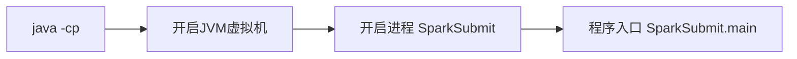

# 第12章 Spark提交流程

## 12. 程序起点 

1）在 spark-class2.cmd 文件中增加打印 %SPARK_CMD% 语句

```powershell title="spark-class2.cmd"
echo %SPARK_CMD%
```

2）在 spark-3.0.0-bin-hadoop3.2\bin 目录上执行 cmd 命令

3）进入命令行窗口，输入

```powershell
bin/spark-submit --class org.apache.spark.examples.SparkPi --master local[2] ./examples/jars/spark-examples_2.12-3.1.3.jar 10
```


4）发现底层执行的命令为

```shell
java -cp  org.apache.spark.deploy.SparkSubmit
```

!!! info "说明"

    java -cp 和 -classpath 一样，是指定类运行所依赖其他类的路径。

8）执行 java -cp 就会开启 JVM 虚拟机，在虚拟机上开启 {==SparkSubmit==} 进程，然后开始执行 main 方法



9）在 IDEA 中全局查找（++ctrl+n++）：org.apache.spark.deploy.SparkSubmit，找到 SparkSubmit 的伴生对象，并找到 main 方法

```java
override def main(args: Array[String]): Unit = {
    val submit = new SparkSubmit() {
... ...
}
}
```

## 12. Spark组件通信

### 12.2.1 Spark中通信框架的发展


Spark 底层采用 {==Netty==} 通信。

### 12.2.2 Spark底层通信原理


- RpcEndpoint：{++RPC 通信终端++}。Spark 针对每个节点（ Client / Master / Worker）都称之为一个 RPC 终端，且都实现 RpcEndpoint 接口，内部根据不同端点的需求，设计不同的消息和不同的业务处理，如果需要发送（询问）则调用 Dispatcher。在 Spark 中，所有的终端都存在生命周期：


- RpcEnv：{++RPC 上下文环境++}。每个 RPC 终端运行时依赖的上下文环境称为 RpcEnv；在当前 Spark 版本中使用的 NettyRpcEnv
- Dispatcher：消息调度（分发）器，针对于 RPC 终端需要发送远程消息或者从远程 RPC 接收到的消息，分发至对应的指令收件箱（发件箱）。如果指令接收方是自己则存入收件箱，如果指令接收方不是自己，则放入发件箱
- Inbox：{++指令消息收件箱++}。一个本地 RpcEndpoint 对应一个收件箱，Dispatcher 在每次向 Inbox 存入消息时，都将对应 EndpointData 加入内部 ReceiverQueue 中，另外 Dispatcher 创建时会启动一个单独线程进行轮询 ReceiverQueue，进行收件箱消息消费
- RpcEndpointRef：{++RpcEndpointRef 是对远程 RpcEndpoint 的一个引用++}。当我们需要向一个具体的 RpcEndpoint 发送消息时，一般我们需要获取到该 RpcEndpoint 的引用，然后通过该应用发送消息
- OutBox：{++指令消息发件箱++}。对于当前 RpcEndpoint 来说，一个目标 RpcEndpoint 对应一个发件箱，如果向多个目标 RpcEndpoint 发送信息，则有多个 OutBox。当消息放入 Outbox 后，紧接着通过 TransportClient 将消息发送出去。消息放入发件箱以及发送过程是在同一个线程中进行
- RpcAddress：表示{++远程的 RpcEndpointRef 的地址++}，Host + Port
- TransportClient：{++Netty 通信客户端++}，一个 OutBox 对应一个 TransportClient，TransportClient 不断轮询 OutBox，根据 OutBox 消息的 receiver 信息，请求对应的远程 TransportServer
- TransportServer：{++Netty 通信服务端++}，一个 RpcEndpoint 对应一个 TransportServer，接受远程消息后调用 Dispatcher 分发消息至对应收发件箱

## 12.3 Spark提交流程（YarnCluster）


